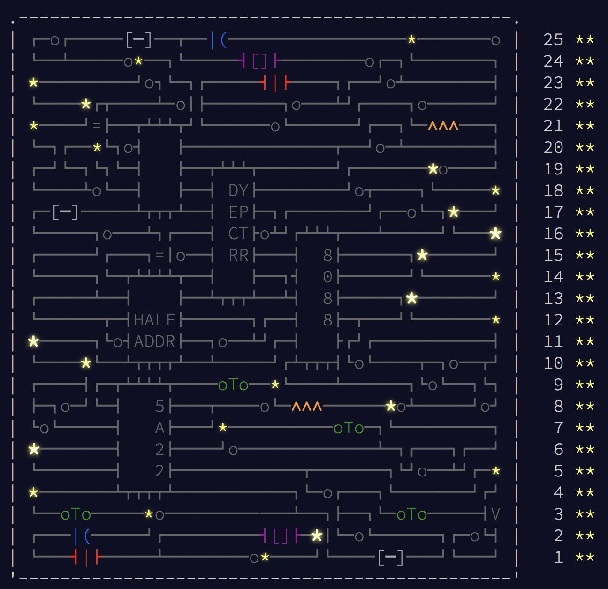

# AdventOfCode2017

Solutions in JS (or) Kotlin (or) Python (or) Rust for Advent of Code 2017

#### Puzzles:
* [Day 1: Inverse Captcha](http://adventofcode.com/2017/day/1)
* [Day 2: Corruption Checksum](http://adventofcode.com/2017/day/2)
* [Day 3: Spiral Memory](http://adventofcode.com/2017/day/3)
* [Day 4: High-Entropy Passphrases](http://adventofcode.com/2017/day/4)
* [Day 5: A Maze of Twisty Trampolines, All Alike](http://adventofcode.com/2017/day/5)
* [Day 6: Memory Reallocation](http://adventofcode.com/2017/day/6)
* [Day 7: Recursive Circus](http://adventofcode.com/2017/day/7)
* [Day 8: I Heard You Like Registers](http://adventofcode.com/2017/day/8)
* [Day 9: Stream Processing](http://adventofcode.com/2017/day/9)
* [Day 10: Knot Hash](http://adventofcode.com/2017/day/10)
* [Day 11: Hex Ed](http://adventofcode.com/2017/day/11)
* [Day 12: Digital Plumber](http://adventofcode.com/2017/day/12)
* [Day 13: Packet Scanners](http://adventofcode.com/2017/day/13)
* [Day 14: Disk Defragmentation](http://adventofcode.com/2017/day/14)
* [Day 15: Dueling Generators](http://adventofcode.com/2017/day/15)
* [Day 16: Permutation Promenade](http://adventofcode.com/2017/day/16)
* [Day 17: Spinlock](http://adventofcode.com/2017/day/17)
* [Day 18: Duet](http://adventofcode.com/2017/day/18)
* [Day 19: A Series of Tubes](http://adventofcode.com/2017/day/19)
* [Day 20: Particle Swarm](http://adventofcode.com/2017/day/20)
* [Day 21: Fractal Art](http://adventofcode.com/2017/day/21)
* [Day 22: Sporifica Virus](http://adventofcode.com/2017/day/22)
* [Day 23: Coprocessor Conflagration](http://adventofcode.com/2017/day/23)
* [Day 24: Electromagnetic Moat](http://adventofcode.com/2017/day/24)
* [Day 25: The Halting Problem](http://adventofcode.com/2017/day/25)

